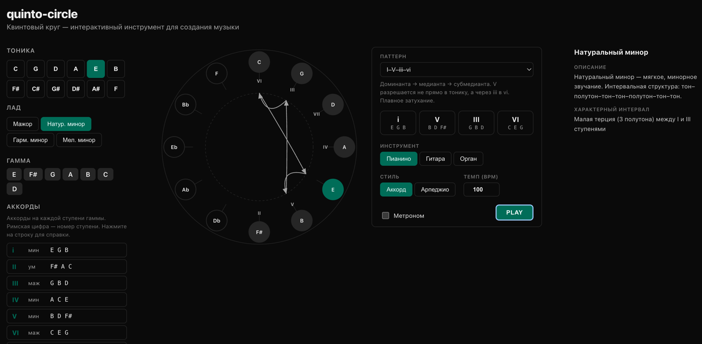

# quinto-circle

An interactive circle of fifths — a tool for exploring harmony, building chord progressions, and playing them back.

**[Live demo](https://evgenykon.github.io/quinto-circle/)**



## Features

- **Circle of fifths:** 12 notes arranged clockwise, highlighting the tonic and scale degrees
- **Key selection:** major, natural/harmonic/melodic minor
- **Scale & chords:** scale degrees I–VII with chord types
- **Theory panel:** reference for key signatures, scale degrees, and chromatic notes
- **Player:** 50 built-in chord progressions, chords and arpeggios, 3 instruments (piano, guitar, organ), adjustable tempo, metronome
- **Visualization:** chord movement graph inside the circle, current chord highlighting

## Getting started

```bash
make build    # build Docker image
make dev      # start dev server at http://localhost:3000
make down     # stop the server
```

## Stack

- Nuxt 3 + Vue 3
- Web Audio API (synthesis without external libraries)
- SVG graphics
- Docker

## Development

Commands run inside the Docker container:

```bash
make run cmd="yarn add <package>"
make down && make dev   # restart after adding dependencies
```
